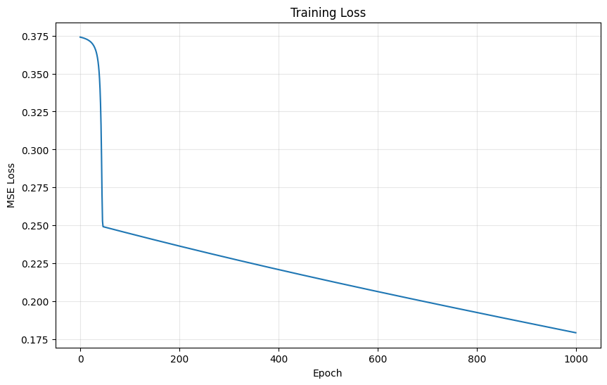
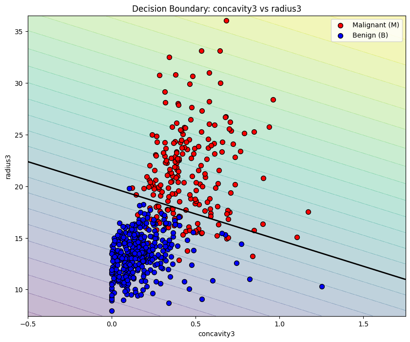

# CSC173 Activity 01 - Neural Network from Scratch

**Date:** October 22, 2025  
**Team:**

- Abuel, John Christian Niño T.
- Palarpalar, Mann Kristof P.
- Senyahan, Kristoffer Neo V.

## Project Overview

This project implements a simple neural network for binary classification using breast cancer diagnostic data. The network is built completely from scratch using only Python and NumPy, with no machine learning libraries. The goal is to deepen understanding of neural network fundamentals including forward propagation, loss computation, backpropagation, gradient descent training, and model evaluation.

## Data Preparation

We used the Breast Cancer Wisconsin Diagnostic dataset obtained from the following source:

- [UCI Machine Learning Repository (Breast Cancer Wisconsin Diagnostic)](https://archive.ics.uci.edu/dataset/17/breast+cancer+wisconsin+diagnostic)  

We selected two features (`'concavity3'` and `'radius3'`) from the dataset for the input layer of the network.

## Network Architecture

- Input layer: 2 neurons (corresponding to selected features)
- Hidden layer: 3 neurons
	- Activation function: ReLU
- Output layer: 1 neuron
	- Activation function: Sigmoid to produce binary classification output

## Implementation Details

- Weight and bias parameters initialized randomly.
- Forward propagation implements layer-wise computations with chosen activation functions.
- Loss computed using Mean Squared Error (MSE).
- Backpropagation calculates gradients of weights and biases.
- Parameters updated using gradient descent.
- Training performed for 1000 iterations.

## Results & Visualization

With `numpy.random.seed(67)`{:.python} and 3 hidden neurons in the hidden layer, after 1000 iterations:

$$
W_{1} = \begin{bmatrix}
0.19524 & 0.68716 & -0.91797\\
1.00147 & 0.14186 & 0.25523
\end{bmatrix}
$$

$$
b_{1} = \begin{bmatrix}
0.01039 & 0.31522 & 0.00000
\end{bmatrix}
$$
$$
W_{2} = \begin{bmatrix}
-0.00319\\
0.49285\\
-0.06768
\end{bmatrix}
$$

$$
b_{2} = \begin{bmatrix}
-1.16904
\end{bmatrix}
$$

### Training Loss



### Decision Boundary



## Team Collaboration

Each member contributed to different components of the network:

- Weight and bias initialization
- Forward propagation coding
- Loss function implementation
- Backpropagation and gradient computation
- Training loop and visualization

## How to Run

1. Clone the GitHub repository:

```sh
git clone [repository_url]
```

2. Have the package and project manager `uv` installed.

	- If it's not installed, run `pip3 install uv` in the terminal.

3. Change directory to the cloned repository.

4. Create a virtual environment using `uv`.

```sh
uv venv
```

5. Activate the Virtual Environment:

	- On macOS/Linux:
	```bash
	source .venv/bin/activate
	```
	- On Windows:
	```psh
	.venv\Scripts\activate
	```
6. Install the required dependencies

```sh
uv sync
```

7. Open the Jupyter notebook.

8. Run all cells sequentially.

9. Explore training loss plot and decision boundary visualizations.

## Summary

This activity provided hands-on experience in building a neural network without relying on high-level ML frameworks. The group collaboratively developed the model, analyzed its training behavior visually, and demonstrated understanding of fundamental AI concepts through both code and documentation.

Video: YouTube